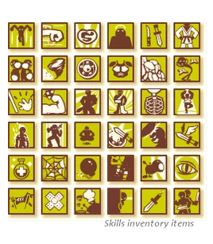
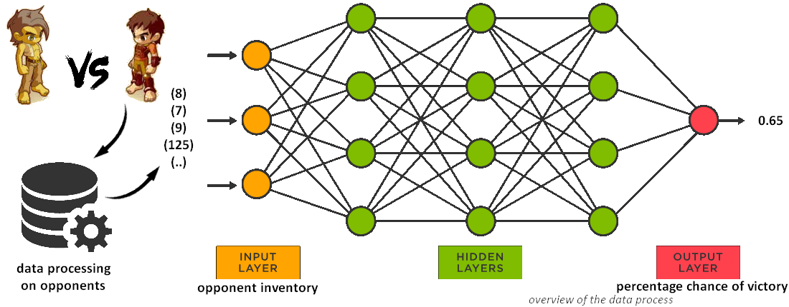

# LaBrute Browser Game Bot

## Description

**LaBrute** is a browser game where you control your own brute, training it to fight other brutes. Each victory earns 1xp, while a defeat results in 1xp and 1 injury. Accumulating 3 injuries prevents your brute from fighting until the next day.

The project had two primary goals:
1. **Optimize the trainings**: Implement algorithms to optimize training sessions for each brute.
2. **Determine the best skills**: Analyze and determine the best skills to create the ultimate brute.

Unfortunately, the game is no longer available, which limited the time to implement all algorithms for the second goal.

## Implementation

### Play the Game with Requests

To manipulate the game and retrieve necessary data from Python, requests exchanged between the computer and the game servers were analyzed using **Burp-Suite**. This included data such as Life, Strength, Agility, Speed, Skills, Weapons, ID, Energy, Wounds, and number of victories for each brute.

By reproducing the correct requests with appropriate headers and up-to-date cookies, Python was able to interact with the game effectively.

    
    

### Neural Network

To maximize the win rate of each brute and expedite their training, a neural network was implemented. This network was based on a dataset of brutes winning or losing battles against others.

The neural network helped in predicting winning chances, aiding in selecting the optimal opponent to fight against. On average, this algorithm improved the win rate by +15% in all matches.

